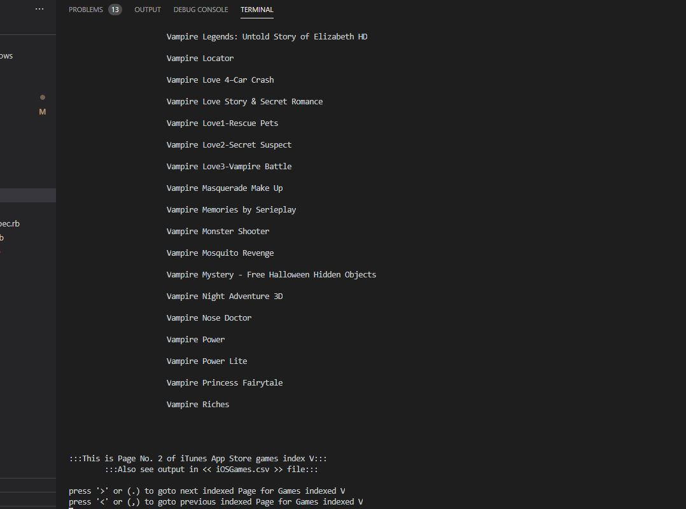

# TinyTuneScraper
This a mini scraper console application for iTunes App store games, developed using ruby. This is a Microverse captsone project for Ruby section. See a quick video of the project walkthrough [here](https://www.loom.com/share/efecaf78d234412fb2a0e8d3b3113e3b). Further instructions on how to run is found under the Instructions below.

## Introduction
The source for the scraping content is [Apple iTunes App Store games](https://apps.apple.com/us/genre/ios-games/id6014). Contents under the iTunes App Store games are categorized according to Most Popular, Alphabetical index and more games. In a similar way, the TinyTuneScraper app you can choose a sorted list to to scrape its content.

  

## Setup Instructions

- Clone this project
- Install dependencies using the command **_bundle install_**
- You can optionally install the dependencies individually using the commands below:
  - **_gem install nokogiri_**
  - **_gem install httparty_**
  
- When completed with dependencies installation, run the commands **_cd bin_** and **_ruby main.rb_**

| | | |
|:-------------------------:|:-------------------------:|:-------------------------:|
|  Welcome screen/ Instructions |  Porpular scrape| Aphabetical scrape |

## Getting Started
- Setup project directory in your ruby environment
- In terminal, with Ruby installed, navigate *bin* diractory and run **_ruby main.rb_**
- Run bash executable in the terminal using command **_./main.rb_**
- Follow the instruction below the welcome screen. Type **_pop_**, **_more_** or a letter between **_|a-z|_**
- If the scrape option has index pages, use **_>_** or **_<_** keys on your keyboard to navigate to the next or previous indexed page

## Built With

- Ruby 2.7
- Nokogiri 1.10.10
- HTTParty 0.18.1
- Rubocop 0.88.0
- Rspec 3.9.0

## Author
👤 **Robert Loterh**

- Github: [@githubhandle](https://github.com/rloterh )
- Twitter: [@twitterhandle](https://twitter.com/RLoterh )
- Linkedin: [linkedin](https://www.linkedin.com/in/robert-loterh-30b265135/)

## 🤝 Contributing

Contributions, issues and feature requests are welcome!

Feel free to check the [issues page](issues/).

## Show your support

Give a ⭐️ if you like this project!

## Acknowledgments

- Source content from [Apple iTunes App Store](https://apps.apple.com)

## 📝 License

This project is [MIT](lic.url) licensed.

